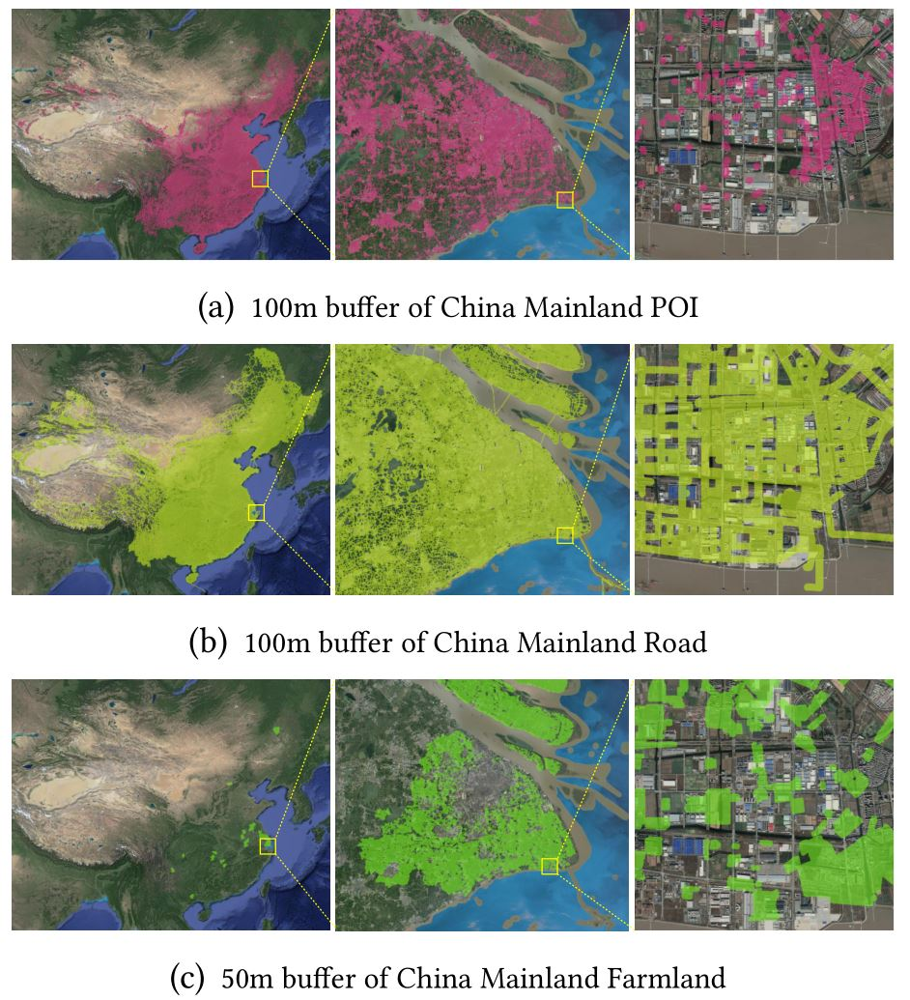

# DiSA: A Display-driven Spatial Analysis Framework for Large-Scale Vector Data (DEMO)

## Setting

***Tab1. Datasets of the demonstration***

| Dataset |Scenario |Records |Size |
| -------------- | ---------- | ---------- | -------------------- |
| China POI |1, 2 |20,258,450  |20,258,450 points |
| China Road |1, 2 |21,898,508  |163,171,928 segments |
| China Farmland |1, 2 |10,520,644  |133,830,561 edges |
| [Xian Trajectories](https://outreach.didichuxing.com/research/opendata) | 1 |148,747  |37,268,701 segments |
| [Chengdu Trajectories](https://outreach.didichuxing.com/research/opendata) | 1 |267,862  |52,839,430 segments |
| [Spain OSMDataset](https://download.geofabrik.de/europe/spain-latest.osm.pbf) | 3 |7,613,793 |87,060,893 items |
| [CDMA BaseStations](https://opencellid.org/) | 4 | 554,364 | 554,364 points |
| [GSM BaseStations](https://opencellid.org/) | 4 | 9,609,750 | 9,609,750 points |
| [LTE BaseStations](https://opencellid.org/) | 4 |10,292,460 | 10,292,460 points |
| [UMTS BaseStations](https://opencellid.org/) | 4 | 20,216,722 | 20,216,722 points |

***Tab2.  Environment of the demonstration***

| Item             | Description                                    |
| ---------------- | ---------------------------------------------- |
| CPU              | 4core, Intel(R) Xeon(R) CPU E5-2680 v3@2.50GHz |
| Memory           | 32 GB                                          |
| Operating System | Centos7                                        |

## Demonstration Scenarios

### Scenario 1 (Raw Data Exploration)

[Scatter plot](http://www.higis.org.cn:8080/hivision/)/ [Patterns filling for polygon objects](http://www.higis.org.cn:8080/hivision_with_pattern/)/ [Visual analysis of trajectories](http://www.higis.org.cn:8080/TrajVISDEMO/)

Scenario 1 demonstrates the ability to provide an interactive exploration of massive raw data in DiSA. Fig 1 shows the visualization results with different rendering styles. Specifically, patterns filling is supported for polygon objects and dataset can be plotted with different styles according to the attributes of each spatial object (e.g., the trajectories can be rendered according to the speeds or directions). Raw data exploration provides access to observe large-scale unknown spatial datasets, which is important to discover implicit in-
formation and parameter settings for further processing. 

*Fig 1 Data exploration with various styles.*

### [Scenario 2](http://www.higis.org.cn:8080/hibuffer10million/) (Spatial Buffer Analysis)

Scenario 2 shows the spatial buffer analysis of large-scale datasets. The interface of the scenario is simple to use, choose a dataset, input the buffer radius, and click the Enter button, then the result layer will be added to the map in real-time. Fig 2 shows the analysis results.

*Fig 2. Buffer analysis of  large-scale datatsets.*

### [Scenario 3](http://www.higis.org.cn:8080/hibo/) (Spatial Overlay Analysis)

Scenario 3 shows an application of overlay analysis for housing site selection. Suppose that a new immigrant in Spain wants to choose a place to live which meets the following conditions: 1) convenient to traffic (within 500m from Highways); 2) convenient for children education (within 200m from Education amenities); 3) convenient to the medical care (within 2000m from Healthcare amenities); 4) near to leisure places (within 1000m from Entertainment, Arts & Culture amenities or Waterways); 5) quiet (at least 300m away from Railways). The conditions can be translated into the following expression. Enter the expression and click the Create-Overlay-Layer button (Fig 3), then the result layer will be added to the map in real-time. Enter the expression and click the Create-Overlay-Layer button, then the result layer will be added to the map in real-time. Fig 4 shows the analysis results, in which the red areas are the recommended housing places.

*Fig3. Input of the housing site selection in Spain*

*Fig 4. Overlay analysis for housing site selection*

### [Scenario 4](http://www.higis.org.cn:8080/CellTowerDEMO/) (Global Cellular Signal Strength Analysis)

DiSA can be applied to some complex spatial analysis problems. Scenario 4 provides real-time analysis of global cellular signal strength (CSS). To the best of our knowledge, this is the first interactive map of global CSS using more than 40 million base stations. CSS reflects the urbanization variables such as population, gross domestic product, built-up area, and electric power consumption. Fig 5 shows the visualization effects of global CSS in DiSA, and it can be used for the geographic analysis of information flows.

*Fig 5. Cellular signal strength distributions (Green:CDMA, Yellow:LTE, White:GSM, Red:UMTS)*

## Contact:

Mengyu Ma@ National University of Defense Technology

Email: mamengyu10@nudt.edu.cn
